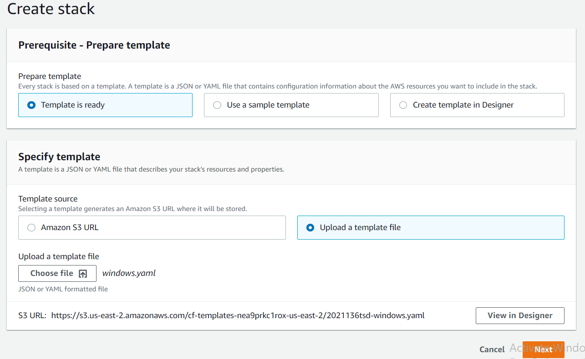
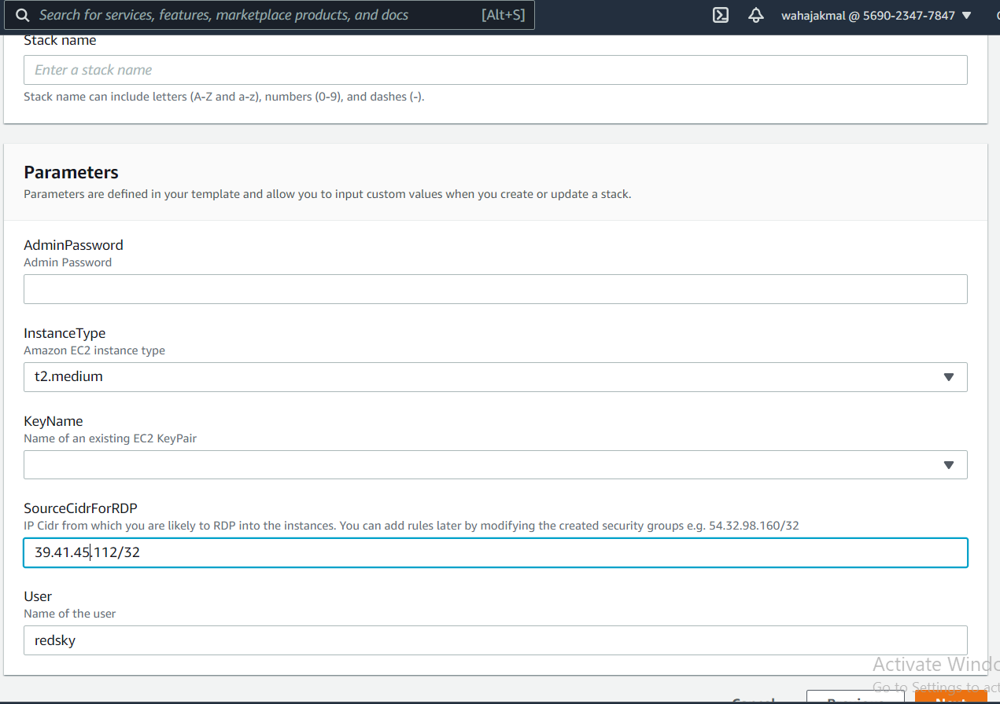
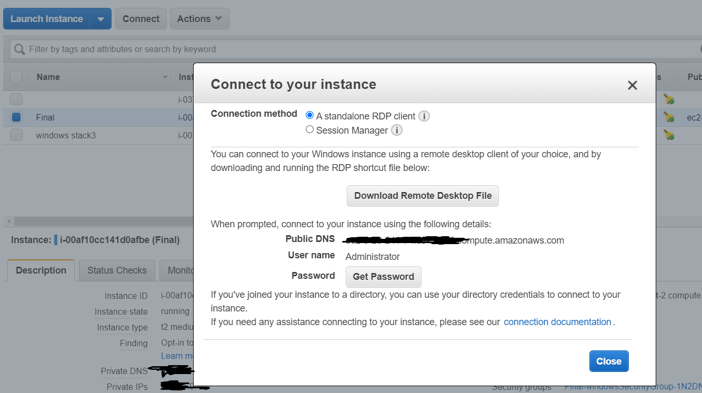

# CloudFormation template to deploy Ec2 Instance (Windows)
### Description:
This cloudformation template will deploy the windows type ec2 instance with pre-installed packages. We have used choco package manager of windows for installation of different packages.

### In order to deploy the cloudformation stack follow these steps:
1- Open the aws console and go to cloudformation

2- Upload the template


3- Give the template name

4- In parameter you have to provide multiple paramter"
    
    1- Admin password : The password needed for the new user. It should be in a specific format like `Admin@123a`
    
    2- User: Name of the user to be created. Make sure the name and password should not be same
    
    3- Instance type: Select the instance type. `t2.medium` is the default one.
    
    4- SourceCidrForRDP: The ip of your computer in order to access the instance. You can get the ip of your system by googling `my ip address`. Copy the address that google shows and paste it in the paramterusing this format `39.42.45.145/32`
    
    5- Make sure you have a keypair already created in the AWS, select the desired keypair from the dropdown.


5- Click next and deploy the cloudformation stack and wait for 5-10 mins

6- Then go to ec2 console and follow these steps:
    
    1- Click on connect and download the remote desktop connection file
    
    2- to get password upload the pem key, which you have given in the paramter


7- Launch the Remote desktop connection and add the password to Login

8- Open the powershell after getting login

9- Check the package installation by typing these commands:
    
    1- git version
    
    2- java -version
    
    3- mvn -version
    
    4- choco list --localonly 

### Step by Step information of Cloudformation template:

The template starts by initializing the paramter value and for some parameter we have made some value as default. Make sure to change your ip in the default value or you can change it from the Cloudformation console as well. 

```
Parameters:
  KeyName:
    Description: Name of an existing EC2 KeyPair
    Type: AWS::EC2::KeyPair::KeyName
    ConstraintDescription: must be the name of an existing EC2 KeyPair.
  AdminPassword:
    Description: Admin Password
    Type: String
    NoEcho: true
    MinLength: 8
    MaxLength: 32
    ConstraintDescription: Must be at least 8 chars long
  User:
    Description: Name of the user
    Type: String
    Default: redsky
  InstanceType:
    Description: Amazon EC2 instance type
    Type: String
    Default: t2.medium
    AllowedValues:
    - t1.micro
    - t2.micro
    - t2.small
    - t2.medium
    - m1.small
    - m1.medium
    - m1.large
    - m1.xlarge
    - m2.xlarge
    - m2.2xlarge
    - m2.4xlarge
    - m3.medium
    - m3.large
    - m3.xlarge
    - m3.2xlarge
    - m4.large
    - m4.xlarge
    - m4.2xlarge
    - m4.4xlarge
    - m4.10xlarge
    - c1.medium
    - c1.xlarge
    - c3.large
    - c3.xlarge
    - c3.2xlarge
    - c3.4xlarge
    - c3.8xlarge
    - c4.large
    - c4.xlarge
    - c4.2xlarge
    - c4.4xlarge
    - c4.8xlarge
    - g2.2xlarge
    - r3.large
    - r3.xlarge
    - r3.2xlarge
    - r3.4xlarge
    - r3.8xlarge
    - i2.xlarge
    - i2.2xlarge
    - i2.4xlarge
    - i2.8xlarge
    - d2.xlarge
    - d2.2xlarge
    - d2.4xlarge
    - d2.8xlarge
    - hi1.4xlarge
    - hs1.8xlarge
    - cr1.8xlarge
    - cc2.8xlarge
    - cg1.4xlarge
    ConstraintDescription: must be a valid EC2 instance type.
  SourceCidrForRDP:
    Description: IP Cidr from which you are likely to RDP into the instances. You
      can add rules later by modifying the created security groups e.g. 54.32.98.160/32
    Type: String
    MinLength: '9'
    MaxLength: '18'
    AllowedPattern: "^([0-9]+\\.){3}[0-9]+\\/[0-9]+$"
    Default: 39.41.46.145/32
Mappings:
  AWSRegion2AMI:
    us-east-2:
      Windows2012r2: ami-0b35ce9c4d7659618
      Windows2016: ami-0ea03bb5978f0255e
      Windows2019: ami-086850e3dda52e84a
```
In this we have initialized the security group port for the windows instance that are the RDP port (3389) and HTTPP port (80).

```
Resources:
  windowsSecurityGroup:
    Type: AWS::EC2::SecurityGroup
    Properties:
      GroupDescription: Enable HTTP and RDP
      SecurityGroupIngress:
      - IpProtocol: tcp
        FromPort: '80'
        ToPort: '80'
        CidrIp: 0.0.0.0/0
      - IpProtocol: tcp
        FromPort: '3389'
        ToPort: '3389'
        CidrIp:
          Ref: SourceCidrForRDP
```
This is the Elastic IP that we have assgined to the instance so that the public doesnot keeps on changing.

```
  windowsEIP:
    Type: AWS::EC2::EIP
    Properties:
      InstanceId:
        Ref: windows
```

In this we have initialized the `cfn-hup.conf, cfn-auto-reloader.conf` and the custom installed package `git`
##### cfn-hup : The cfn-hup helper is a daemon that detects changes in resource metadata and runs user-specified actions when a change is detected. This allows you to make configuration updates on your running Amazon EC2 instances through the UpdateStack API action.
##### cfn-auto-reloader.conf, the configuration file for the hook used by cfn-hup to initiate an update (calling cfn-init) when the metadata in AWS::CloudFormation::Init changes.

```
 windows:
    Type: AWS::EC2::Instance
    Metadata:
      AWS::CloudFormation::Init:
        config:
          files:
            c:\cfn\cfn-hup.conf:
              content:
                Fn::Join:
                - ''
                - - "[main]\n"
                  - stack=
                  - Ref: AWS::StackId
                  - "\n"
                  - region=
                  - Ref: AWS::Region
                  - "\n"
            c:\cfn\hooks.d\cfn-auto-reloader.conf:
              content:
                Fn::Join:
                - ''
                - - "[cfn-auto-reloader-hook]\n"
                  - 'triggers=post.update'
                  - 'path=Resources.windows.Metadata.AWS::CloudFormation::Init'
                  - 'action=cfn-init.exe -v -s '
                  - Ref: AWS::StackId
                  - " -r windows"
                  - " --region "
                  - Ref: AWS::Region
                  - "\n"
            C:\Downloads\packages\Git-2.31.1-64-bit.exe:
              source: https://github.com/git-for-windows/git/releases/download/v2.31.1.windows.1/Git-2.31.1-64-bit.exe
          commands:
            1-Install git:
              command: powershell.exe -ExecutionPolicy RemoteSigned -Command Start-Process -FilePath C:\Downloads\packages\Git-2.31.1-64-bit.exe -Args '/silent /install' -Verb RunAs -wait;
          services:
            windows:
              cfn-hup:
                enabled: 'true'
                ensureRunning: 'true'
                files:
                - c:\cfn\cfn-hup.conf
                - c:\cfn\hooks.d\cfn-auto-reloader.conf
```
We have installed git in a custom folder that we have created in user data that is `C:\Downloads\packages`. 
This snippet that where to get the GIT exe file from net
```
            C:\Downloads\packages\Git-2.31.1-64-bit.exe:
              source: https://github.com/git-for-windows/git/releases/download/v2.31.1.windows.1/Git-2.31.1-64-bit.exe
```
This snippet runs the exe file in order to install the git
```
          commands:
            1-Install git:
              command: powershell.exe -ExecutionPolicy RemoteSigned -Command Start-Process -FilePath C:\Downloads\packages\Git-2.31.1-64-bit.exe -Args '/silent /install' -Verb RunAs -wait;
```
In this snippet below, we have referenced the paramters to the ec2 instance. In the userdata we are performing the actions listed below:
    
    1- Creating the user and its password (getting from the parameters)
    
    2- Adding the newly created user to administrators group
    
    3- Installing choco (windows package manager) in CMD
    
    4- Installing choco in powershell
    
    5- Creating the custom folder in `C:\Downloads\packages`
    
    6- `cfn-init.exe` reads the metadata we have initialized above. In this command we provide the region, resource name and stackid
    
    7- `cfn-signal.exe` The cfn-signal helper script signals CloudFormation to indicate whether Amazon EC2 instances have been successfully created or updated
    
    8- Upgrading the choco
    
    9- Installing java 11
    
    10- Installing java 8
    
    11- Installing maven:3.5.2
    
    12- Installing cygwin
    
    13- Installing mircrosoft prerequisite needed by wixtoolset
    
    14- Installing wixtoolset
```
    Properties:
      InstanceType:
        Ref: InstanceType
      ImageId:
        Fn::FindInMap:
        - AWSRegion2AMI
        - Ref: AWS::Region
        - Windows2012r2
      SecurityGroups:
      - Ref: windowsSecurityGroup
      KeyName:
        Ref: KeyName
      UserData:
        Fn::Base64: 
          !Sub |
            <script>
            net user /add ${User} ${AdminPassword}
            net localgroup administrators ${User} /add
            @"%SystemRoot%\System32\WindowsPowerShell\v1.0\powershell.exe" -NoProfile -InputFormat None -ExecutionPolicy Bypass -Command "[System.Net.ServicePointManager]::SecurityProtocol = 3072; iex ((New-Object System.Net.WebClient).DownloadString('https://chocolatey.org/install.ps1'))" && SET "PATH=%PATH%;%ALLUSERSPROFILE%\chocolatey\bin"
            Set-ExecutionPolicy Bypass -Scope Process -Force; [System.Net.ServicePointManager]::SecurityProtocol = [System.Net.ServicePointManager]::SecurityProtocol -bor 3072; iex ((New-Object System.Net.WebClient).DownloadString('https://chocolatey.org/install.ps1'))
            mkdir C:\Downloads\packages
            cfn-init.exe -v --stack ${AWS::StackId} --resource windows --region ${AWS::Region}
            cfn-signal.exe -e %ERRORLEVEL% --stack ${AWS::StackId} --resource windows --region ${AWS::Region}
            choco upgrade chocolatey -y
            choco install openjdk11 -y 
            choco install openjdk8 -y 
            choco install maven --version=3.5.2 -y 
            choco install cygwin -y
            powershell Install-WindowsFeature Net-Framework-Core
            choco install wixtoolset -y 
            </script>
```